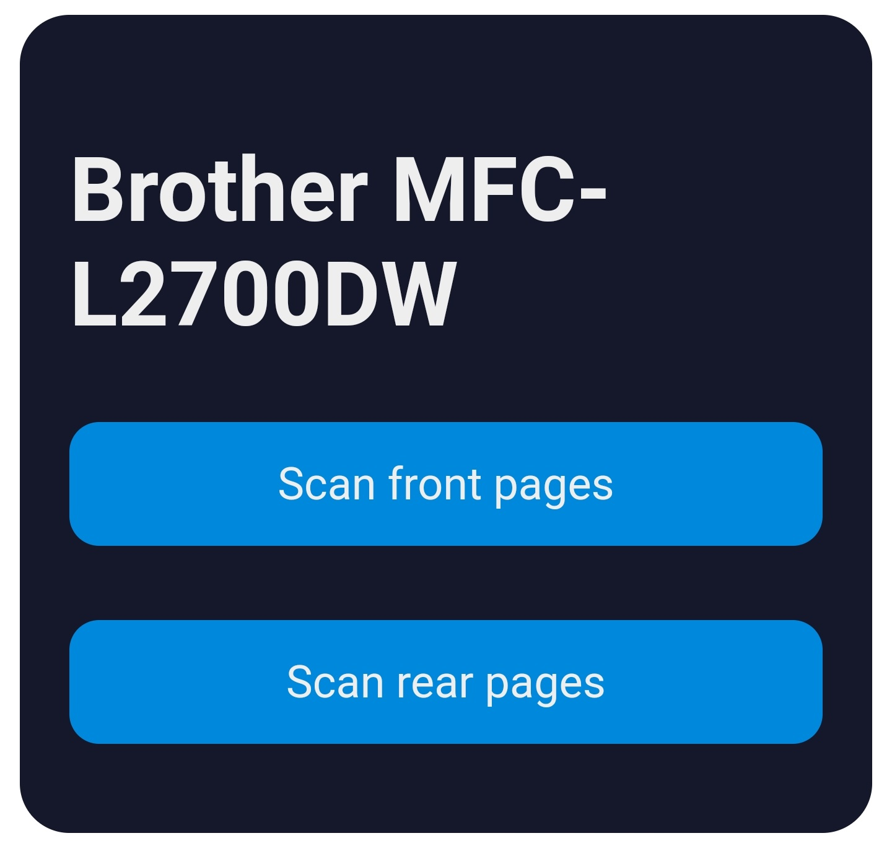

# Brother Scanner
This is the dockerized scanner setup for Brother scanners. It allows you to run
your scan server in a Docker environment and thus also on devices such as a Synology
DiskStation.

## Requirements
Take note that the Brother scanner drivers require access to the host network, thus
the container needs to be started with --net=host. See run.sh for example.

## Usage
You can configure the tool via environment variables. The following are required:

| Variable | Type | Description |
| ------------- | ------------- | ------------- |
| NAME  | mandatory | Arbitrary name to give your scanner. Displayed on scanner, if multiple servers are running. |
| MODEL  | mandatory | Model of your scanner (e.g., MFC-L2700DW) |
| IPADDRESS | mandatory | IP Address of your scanner |
| RESOLUTION | optional | DPI resolution of scan, refer to capabilities of printer on startup |

### Docker Example
```bash
docker run \
    -d \
    -v "/home/$USER/scans:/scans" \
    -v "$PWD/script:/opt/brother/scanner/brscan-skey/script/" \
    -e NAME="Scanner" \
    -e MODEL="MFC-L2700DW" \
    -e IPADDRESS="10.0.0.1" \
    --net=host \
    ghcr.io/philippmundhenk/brotherscannerdocker
```

Note that the mounted folder /scans needs to have the correct permissions.
By default, the scanner will run with user uid 1000 and gid 1000.
You may change this through setting the environment variables UID and GID.

### Docker Compose Example
```yaml
version: '3'

services:
    brother-scanner:
        image: ghcr.io/philippmundhenk/brotherscannerdocker
        volumes:
            - /var/docker/brotherscanner/scans:/scans
        environment:
            - NAME=Scanner
            - MODEL=MFC-L2700DW
            - IPADDRESS=10.0.0.1
            - OCR_SERVER=localhost # optional, for OCR
            - OCR_PORT=32800 # optional, for OCR
            - OCR_PATH=ocr.php # optional, for OCR
            - UID=1000 # optional, for /scans permissions
            - GID=1000 # optional, for /scans permissions
            - TZ=Europe/Berlin # optional, for correct time in scanned filenames
            - WEBSERVER=true # optional, activates GUI & API
            - PORT=33355 # optional, sets port for webserver (default: 80)
            - DISABLE_GUI_SCANTOIMAGE=true # optional, deactivates button "Scan to image"
            - DISABLE_GUI_SCANTOOCR=true # optional, deactivates button "Scan to OCR"
            - RENAME_GUI_SCANTOFILE="Scan front pages" # optional, renames button "Scan to file" to "Scan front pages"
            - RENAME_GUI_SCANTOEMAIL="Scan rear pages" # optional, renames button "Scan to email" to "Scan rear pages"
        restart: unless-stopped
        network_mode: "host"

    # optional, for OCR
    ocr:
      image: ghcr.io/philippmundhenk/tesseractocrmicroservice
      restart: unless-stopped
      ports:
          - 32800:80

```

## Customize
As the standard scripts might not working particularly well for your purpose, you may customize them to your needs.
Have a look in the folder script/ for ideas. These scripts show some examples on how one might use the buttons on the printer.
If you change these scripts, make sure to leave the filename as is, as the Brother drivers will call these scripts.
Each script corresponds to a shortcut button on the scanner. 
This way you can customize the actions running on your scanner.

Hint: These scripts don't necessarily need to do scanning tasks.
You can add any shell script here.

You may mount the scripts like this: ```-v "$PWD/script/:/opt/brother/scanner/brscan-skey/script/"```

## FTPS upload
In addition to the storage in the mounted volume, you can use FTPS (Secure FTP) Upload.
To do so, set the following environment variables to your values:
```
- FTP_USER="scanner"
- FTP_PASSWORD="scanner"
- FTP_HOST="ftp.mydomain.com"
- FTP_PATH="/"
```

This only works with the scripts offered here in folder script/ (see Customize).

## Automatic Synchronization Solutions
Many automatic synchronization solutions, such as Synology CloudStation, are notified
about changes in the filesystem through inotify (see http://man7.org/linux/man-pages/man7/inotify.7.html).
As the volume is mounted in Docker, the security mechanisms isolate the host and container
filesystem. This means that such systems do not work.

To solve this issue, a simple 'sed "" -i' can be performed on the file. The scripts in folder script/ use SSH
to execute this command. This generates an inotify event, in turn starting synchronisation.
To use this option, set the following variables to your values:
```
- SSH_USER="admin"
- SSH_PASSWORD="admin"
- SSH_HOST="localhost"
- SSH_PATH="/path/to/scans/folder/"
```
Of course this requires SSH access to the host. If this is not available, consider the FTPS option.

## OCR
This image is prepared to utilize an OCR service, such as [my TesseractOCRMicroservice](https://github.com/PhilippMundhenk/TesseractOCRMicroservice).
This uploads, waits for OCR to complete and downloads the file again.
The resulting PDF file is saved in the /scans directory, with the appendix "-ocr" in the filename.
To use this option, set the following variables to your values:
```
- OCR_SERVER=192.168.1.101
- OCR_PORT=8080
- OCR_PATH=ocr.php
```
This will call the OCR service at https://192.168.1.101:8080/ocr.php.

## Webserver
This image comes with an integrated webserver, allowing you to control the scanning functions also via API or GUI.
To activate the webserver, you need to set an according environment variable.
By default, the image uses port 80, but you may configure that.
Additionally, for the GUI, you can rename and hide individual functions.
here is an example of the environment:
```
- WEBSERVER=true # optional, activates GUI & API
- PORT=33355 # optional, sets port for webserver (default: 80)
- DISABLE_GUI_SCANTOIMAGE=true # optional, deactivates button "Scan to image"
- DISABLE_GUI_SCANTOOCR=true # optional, deactivates button "Scan to OCR"
- RENAME_GUI_SCANTOFILE="Scan front pages" # optional, renames button "Scan to file" to "Scan front pages"
- RENAME_GUI_SCANTOEMAIL="Scan rear pages" # optional, renames button "Scan to email" to "Scan rear pages"
```

### GUI
You can access the GUI under the IP of your container and the set port (or 80 in default case).
With the config above, the result will look something like this:


### API
The GUI uses a minimal "API" at the backend, which you can also use from other tooling (e.g., Home Assistant or a control panel near your printer).
To scan, simply call `http://<ContainerIP>:<Port>/scan.php?target=<file|email|image|OCR>`